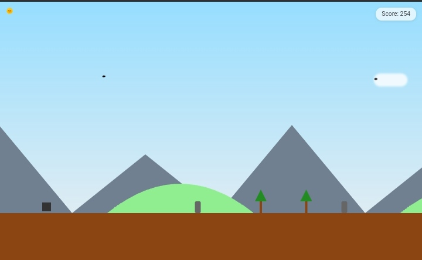
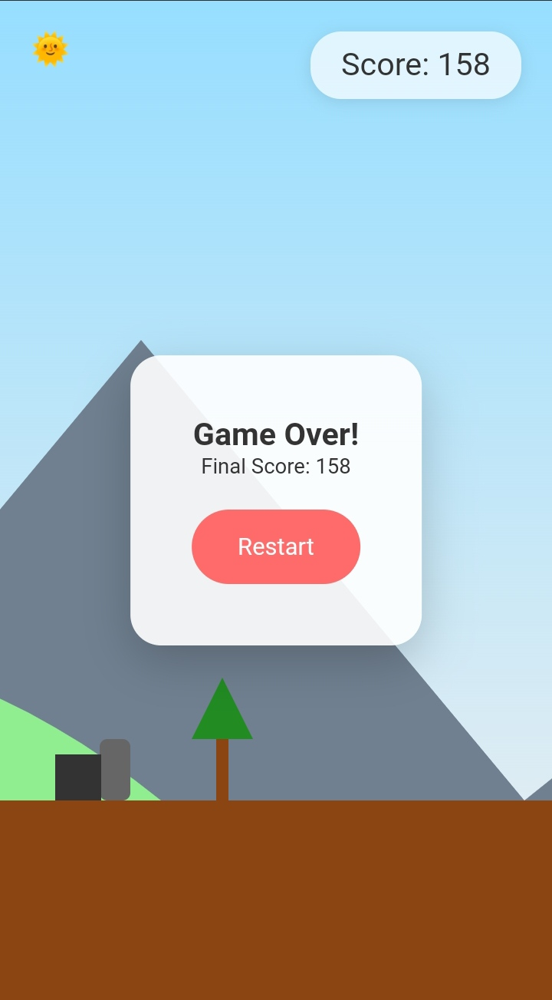

# Box Runner

Box Runner is a fun, browser-based endless runner game built with HTML, CSS, and JavaScript. Players control a box that must jump over obstacles, collect power-ups and survive as long as possible in a changing environment.

## Features

- Simple, one-button gameplay (spacebar or touch to jump)
- Progressively increasing difficulty
- Obstacle generation
- Collectible power-ups for temporary invincibility
- Changing environments (default, winter, desert, beach)
- Day/night mode toggle
- Parallax scrolling background
- Animated elements (running box, floating clouds, flying birds)
- Score tracking and game over screen

## How to Play

1. Open the `index.html` file in a modern web browser.
2. Press the spacebar or tap the screen (on mobile devices) to make the box jump.
3. Avoid obstacles by timing your jumps correctly.
4. Collect golden power-up orbs for temporary invincibility.
5. Try to achieve the highest score possible!

## Game Elements

- **Box**: The player character you control
- **Obstacles**: Some objects you must jump over
- **Power-ups**: Golden orbs that grant temporary invincibility
- **Trees**: Decorative elements that appear randomly
- **Birds**: Flying creatures that add to the game's atmosphere
- **Clouds**: Floating elements in the background

## Technical Details

The game is built using the following technologies:

- HTML5
- CSS3 (with animations and SVG graphics)
- JavaScript (ES6+)

## Future Enhancements

- Add sound effects and background music
- Implement different types of obstacles and power-ups
- Create a leaderboard system
- Add touch controls for mobile devices
- Optimize performance for smoother gameplay on lower-end devices

## Contributing

Contributions to Box Runner are welcome! Please feel free to submit a Pull Request.

## License

This project is open source and available under the [MIT License](LICENSE).

## Credits

Created by JohnDev19 (JOHN RÉ)  as a fun project to explore game development with web technologies.
